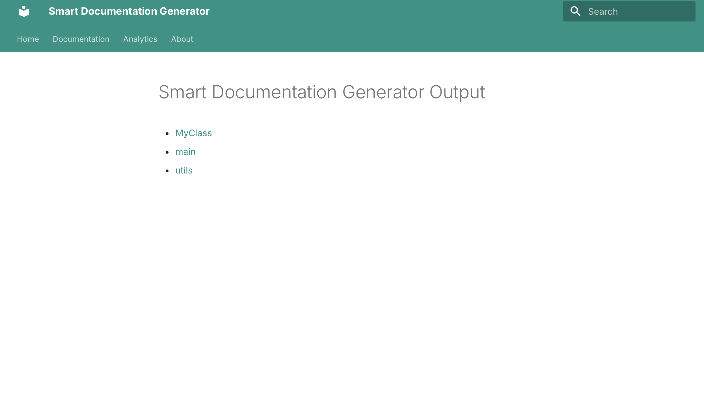
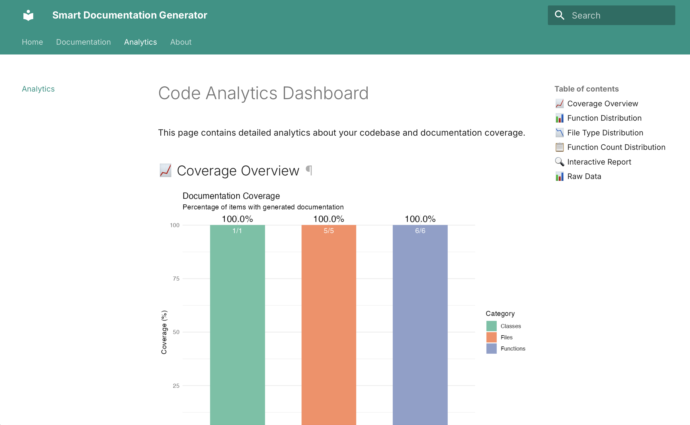

# Smart Documentation Generator

An AI-powered tool that generates documentation for C++ codebases with analytics and a professional website.

## Features

- **C++ Parser** - Fast code analysis using C++17
- **AI Documentation** - LLM-powered function and class documentation
- **Mermaid Diagrams** - Automatic flowchart generation
- **R Analytics** - Code metrics and coverage statistics
- **Professional Website** - Responsive MkDocs material theme

## Prerequisites

- C++17 compiler (g++ or clang)
- Python 3.8+ with pip
- R 4.0+ with packages: jsonlite, ggplot2, dplyr, plotly
- Ollama (for local LLM) or OpenAI API key

## Installation

```bash
# Clone the repository
git clone https://github.com/Masan2k5/Smart-Documentation-Generator.git
cd Smart-Documentation-Generator

# Build the C++ parser
mkdir build && cd build
cmake ../cpp_parser
make
cd ..

# Set up the Python environment
cd python_ai
python3 -m venv venv
source venv/bin/activate
pip install -r requirements.txt
pip install --upgrade pip #if there is a new version available
cd ..
```

## Usage

# Run the complete pipeline
```bash
./generate_everything.sh
```

# Or run individual components

```bash
# 1. Parse C++ code
cd build && ./parser ../sample_project

# 2. Generate AI documentation
cd python_ai && source venv/bin/activate && python3 generate_docs.py

# 3. Run R analytics
cd r_analytics && Rscript analyze_docs.R && Rscript -e "rmarkdown::render('report.Rmd')"

# 4. Build website
cd website && ./build_site.sh && mkdocs serve
```
## View the Website

After building, either:
```bash
# 1. Run the local server
cd website && mkdocs serve
# Then open http://127.0.0.1:8000 in your browser
```
```bash
# 2. Open the static site directly
open website/site/index.html
```

## Sample Output

###Documentation Page


###Analytics Dashboard


## Built With

| Component | Technology | Purpose |
|-----------|------------|---------|
| Code Parser | C++17 + filesystem | Fast file scanning and analysis |
| AI Generation | Python + Ollama | Documentation with LLMs |
| Analytics | R + ggplot2 | Statistics and visualizations |
| Website | MkDocs Material | Professional documentation site |
| Diagrams | Mermaid | Visual code representations |

## License

MIT License - feel free to use and adapt for your own projects.

## Author

Masud Muradli - Masan2k5
