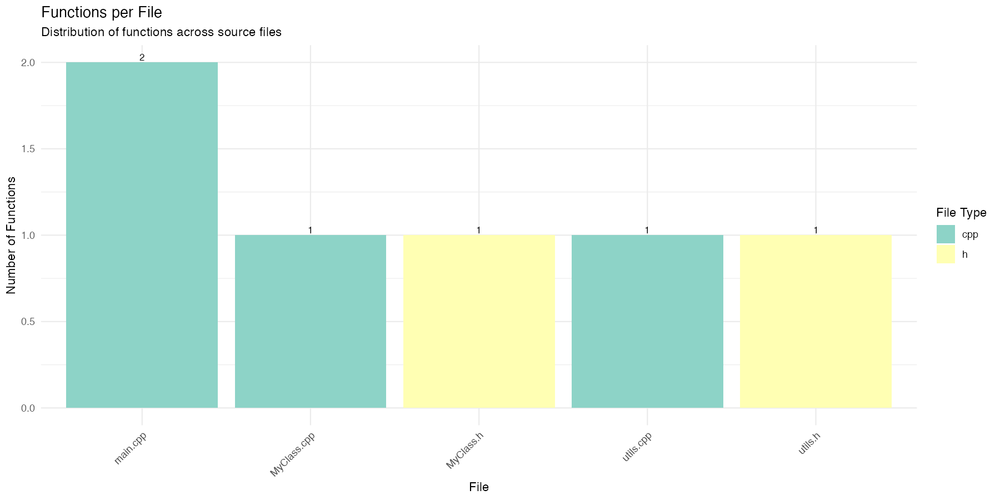
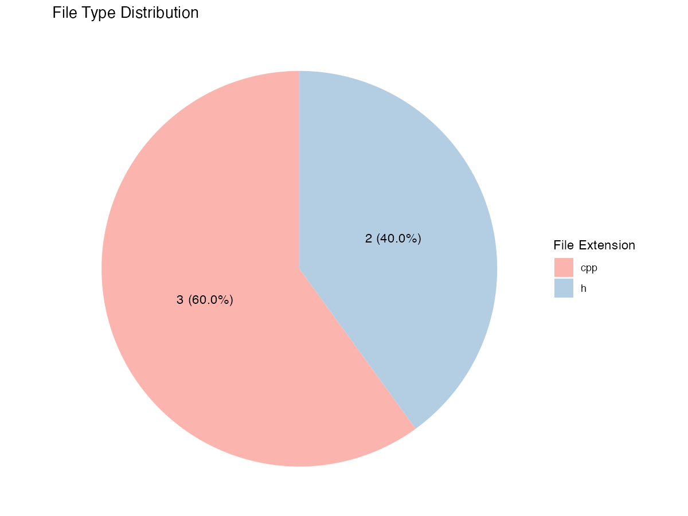
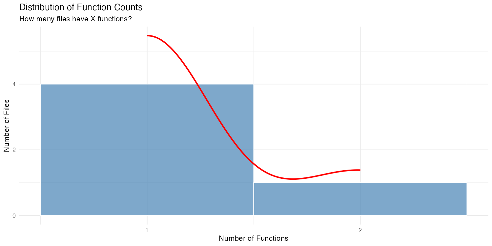

```{r `setup`, include=FALSE}
knitr::opts_chunk$set(echo = FALSE, warning = FALSE, message = FALSE)
library(knitr)
library(ggplot2)
library(dplyr)
library(tidyr)
library(DT)
library(plotly)
library(kableExtra)
```

```{r `load-analyze-docs`, include=FALSE}
source("analyze_docs.R", local = TRUE)
```


```{r `create-summary-table`, include=FALSE}
summary_table <- file_summary %>%
  select(filename, file_ext, function_count, class_count, total_items) %>%
  arrange(desc(total_items))

names(summary_table) <- c("File", "Type", "Functions", "Classes", "Total Items")
```


```{r `create-stats-tables`, include=FALSE}
if (exists("stats") && !is.null(stats)) {
  stats_table <- data.frame(
    Metric = c("Total Files", "Files with Docs", "Total Functions", "Functions Documented",
               "Total Classes", "Classes Documented", "Diagrams Generated"),
    Value = c(stats$total_files, stats$files_with_docs, 
              stats$total_functions, stats$functions_documented,
              stats$total_classes, stats$classes_documented,
              stats$diagrams_generated)
  )
  
  coverage_table <- data.frame(
    Category = c("Functions", "Classes", "Files"),
    Coverage = c(sprintf("%.1f%%", stats$function_coverage),
                 sprintf("%.1f%%", stats$class_coverage),
                 sprintf("%.1f%%", stats$files_with_docs / stats$total_files * 100))
  )
}
```

## Executive Summary

This report provides a comprehensive analysis of the code base and the documentation generated by the Smart Documentation Generator. The tool analyzed `r nrow(file_summary)` source files, containing `r sum(file_summary$function_count)` functions and `r sum(file_summary$class_count)` classes.

```{r `executive-summary-stats`, include=FALSE}
if (exists("stats") && !is.null(stats)) {
  cat("\n### Documentation Coverage\n\n")
  cat("The documentation generator successfully documented:\n")
  cat(sprintf("- **%.1f%%** of functions (%d/%d)\n", 
              stats$function_coverage, stats$functions_documented, stats$total_functions))
  cat(sprintf("- **%.1f%%** of classes (%d/%d)\n", 
              stats$class_coverage, stats$classes_documented, stats$total_classes))
  cat(sprintf("- **%.1f%%** of files (%d/%d)\n", 
              stats$files_with_docs / stats$total_files * 100, 
              stats$files_with_docs, stats$total_files))
  cat(sprintf("\nA total of **%d** Mermaid diagrams were generated.\n", stats$diagrams_generated))
} else {
  cat("\n*Coverage statistics not available. Run the Python documentation generator first.*\n")
}
```
## 1. File Summary

The table below shows all source files in the project, along with their function and class counts.
```{r `file-summary-datatable`}
datatable(summary_table, 
          options = list(
            pageLength = 10, 
            scrollX = TRUE,
            dom = 'Bfrtip',
            buttons = c('copy', 'csv', 'excel')
          ),
          class = 'cell-border stripe hover',
          rownames = FALSE) %>%
  formatStyle('Functions',
              background = styleColorBar(summary_table$Functions, 'lightblue')) %>%
  formatStyle('Classes',
              background = styleColorBar(summary_table$Classes, 'lightgreen'))
```
              
## 2. Code Structure Analysis

### 2.1 Function Distribution

The bar chart below shows the distribution of functions across all source files.



### 2.2 File Type Distribution

This pie chart illustrates the distribution of different file types in the codebase.



### 2.3 Function Count Distribution

The histogram shows how many files contain specific numbers of functions, helping identify code complexity patterns.



## 3. Documentation Coverage Analysis
```{r `coverage-analysis`}
if (exists("stats") && !is.null(stats)) {
  # Display coverage table
  knitr::kable(coverage_table, 
               caption = "Documentation Coverage Summary",
               col.names = c("Category", "Coverage")) %>%
    kable_styling(bootstrap_options = c("striped", "hover"))
  
  # Create enhanced coverage plot
  coverage_data <- data.frame(
    Category = c("Functions", "Classes", "Files"),
    Documented = c(stats$functions_documented, stats$classes_documented, stats$files_with_docs),
    Total = c(stats$total_functions, stats$total_classes, stats$total_files),
    Coverage = c(stats$function_coverage, stats$class_coverage,
                 stats$files_with_docs / stats$total_files * 100)
  )
  
  ggplot(coverage_data, aes(x = Category, y = Coverage, fill = Category)) +
    geom_bar(stat = "identity", width = 0.7) +
    geom_text(aes(label = sprintf("%.1f%%", Coverage)), vjust = -0.5, size = 5) +
    geom_text(aes(label = sprintf("%d/%d", Documented, Total)), 
              vjust = 1.5, color = "white", size = 4) +
    theme_minimal() +
    labs(title = "Documentation Coverage by Category",
         subtitle = "Percentage of items with generated documentation",
         x = "", 
         y = "Coverage (%)") +
    scale_fill_brewer(palette = "Set2") +
    ylim(0, 100) +
    theme(
      plot.title = element_text(size = 16, face = "bold"),
      plot.subtitle = element_text(size = 12),
      axis.text = element_text(size = 12),
      axis.title = element_text(size = 12),
      legend.position = "none"
    )
  
  # Save a copy
  ggsave(file.path(plots_dir, "coverage_enhanced.png"), width = 10, height = 6, dpi = 150)
} else {
  plot(1, type = "n", axes = FALSE, xlab = "", ylab = "")
  text(1, 1, "Coverage data not available. Run the Python documentation generator first.", 
       cex = 1.2, col = "darkred")
}
```

### 3.1 Detailed Statistics

```{r `detailed-stats-table`}
if (exists("stats") && !is.null(stats)) {
  knitr::kable(stats_table, 
               caption = "Detailed Documentation Statistics",
               col.names = c("Metric", "Value")) %>%
    kable_styling(bootstrap_options = c("striped", "hover"))
}
```

## 4. Interactive Data Exploration

The interactive scatter plot below shows the relationship between the number of functions and classes in each file. Hover over points to see detailed information about each file.

```{r `interactive-plot-embed`, include=FALSE}
if (file.exists(file.path(output_dir, "interactive_scatter.html"))) {
  cat('<iframe src="interactive_scatter.html" width="100%" height="600px" style="border:none;"></iframe>')
} else {
  cat("*Interactive plot not available. Run analyze_docs.R first.*")
}
```

## 5. Complexity Analysis

### 5.1 Top 10 Most Complex Files

Files with the highest total number of functions and classes (potential complexity hotspots):

```{r `top-complex-files-table`}
top_files <- file_summary %>%
  arrange(desc(total_items)) %>%
  head(10) %>%
  select(filename, file_ext, function_count, class_count, total_items)

names(top_files) <- c("File", "Type", "Functions", "Classes", "Total Items")

knitr::kable(top_files, 
             caption = "Top 10 Most Complex Files",
             format.args = list(big.mark = ",")) %>%
  kable_styling(bootstrap_options = c("striped", "hover"))
```

### 5.2 Files with No Functions

Files that might be headers, resources, or need investigation:

```{r `no-functions-files-table`}
no_func_files <- file_summary %>%
  filter(function_count == 0) %>%
  select(filename, file_ext, class_count)

if (nrow(no_func_files) > 0) {
  names(no_func_files) <- c("File", "Type", "Classes")
  knitr::kable(no_func_files, 
               caption = "Files with No Functions") %>%
    kable_styling(bootstrap_options = c("striped", "hover"))
} else {
  cat("*All files contain at least one function.*")
}
```

## 6. Recommendations

Based on the analysis, here are some recommendations:

```{r `generate-recommendations`}
recommendations <- c()

# Check coverage
if (exists("stats") && !is.null(stats)) {
  if (stats$function_coverage < 80) {
    recommendations <- c(recommendations, 
                         "- **Improve function documentation**: Function coverage is below 80%. Consider generating docs for remaining functions.")
  }
  if (stats$class_coverage < 80) {
    recommendations <- c(recommendations,
                         "- **Enhance class documentation**: Class coverage is below 80%. Document remaining classes.")
  }
}

# Check for complex files
complex_threshold <- quantile(file_summary$total_items, 0.9)
complex_files <- file_summary %>% filter(total_items >= complex_threshold)
if (nrow(complex_files) > 0) {
  recommendations <- c(recommendations,
                       sprintf("- **Review complex files**: %d files have unusually high complexity (≥%d items). Consider refactoring.",
                               nrow(complex_files), complex_threshold))
}

# Check file type distribution
if (nrow(file_type_summary) > 0) {
  main_type <- file_type_summary %>% arrange(desc(count)) %>% slice(1)
  recommendations <- c(recommendations,
                       sprintf("- **File type consistency**: %s files dominate (%d%%). Ensure consistent coding standards.",
                               main_type$file_ext, round(main_type$percentage)))
}

if (length(recommendations) > 0) {
  cat(paste(recommendations, collapse = "\n"))
} else {
  cat("*No specific recommendations at this time. The project appears well-structured.*")
}
```

## 7. Appendix

### 7.1 Raw Data Access

The complete analysis data is available in JSON format:

- `code_analysis.json` - Original code structure data from C++ parser
- `statistics.json` - Documentation statistics from Python generator

### 7.2 Generation Information
```{r `generation-info`}
cat(paste("- **Report generated:**", Sys.time()))
cat(paste("\n- **R version:**", R.version.string))
cat(paste("\n- **Packages used:** jsonlite, ggplot2, dplyr, plotly, DT, knitr"))
```

Report generated automatically by the Smart Documentation Generator R Analytics module.