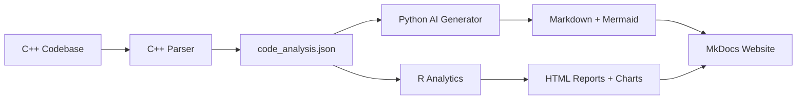

# About This Project

## The Smart Documentation Generator

This tool was built to automatically generate high-quality documentation for C++ codebases using AI. It combines multiple technologies to create a complete documentation solution.

## Architecture



## Technologies Used

| Component | Technology | Purpose |
|-----------|------------|---------|
| Code Parser | C++17 + filesystem | Fast file scanning and analysis |
| AI Generation | Python + Ollama | Documentation with LLMs |
| Analytics | R + ggplot2 | Statistics and visualizations |
| Website | MkDocs Material | Professional documentation site |
| Diagrams | Mermaid | Visual code representations |

## Project Structure

```
smart-doc-gen/
├── cpp_parser/          # C++ source parser
├── python_ai/            # Python AI generator
├── r_analytics/          # R analysis scripts
├── build/                # Build outputs
├── output/               # Generated documentation
└── website/              # MkDocs website
```

## The Team

This project was created as a portfolio piece demonstrating full-stack development with multiple programming languages and AI integration.

## License

MIT License - feel free to use and adapt for your own projects.